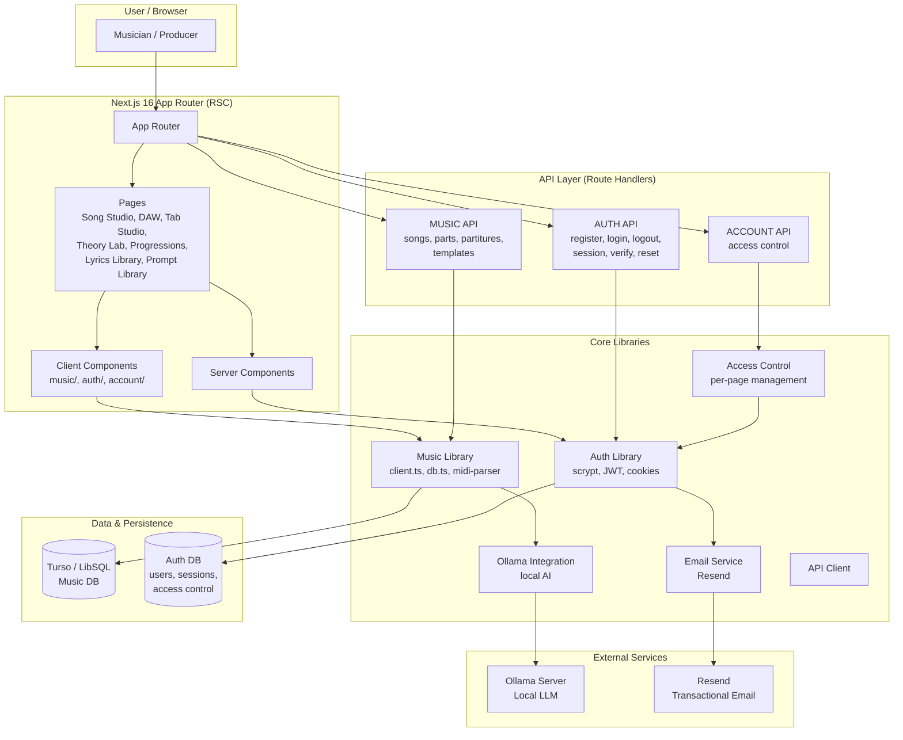
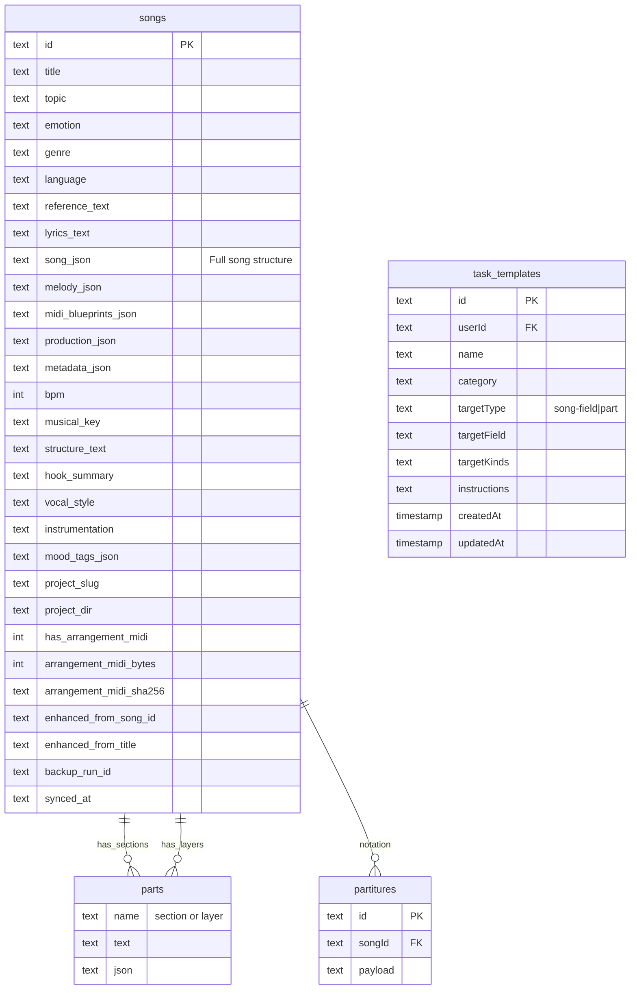
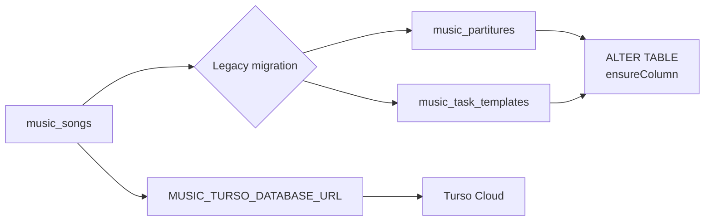
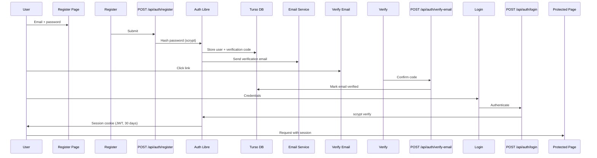
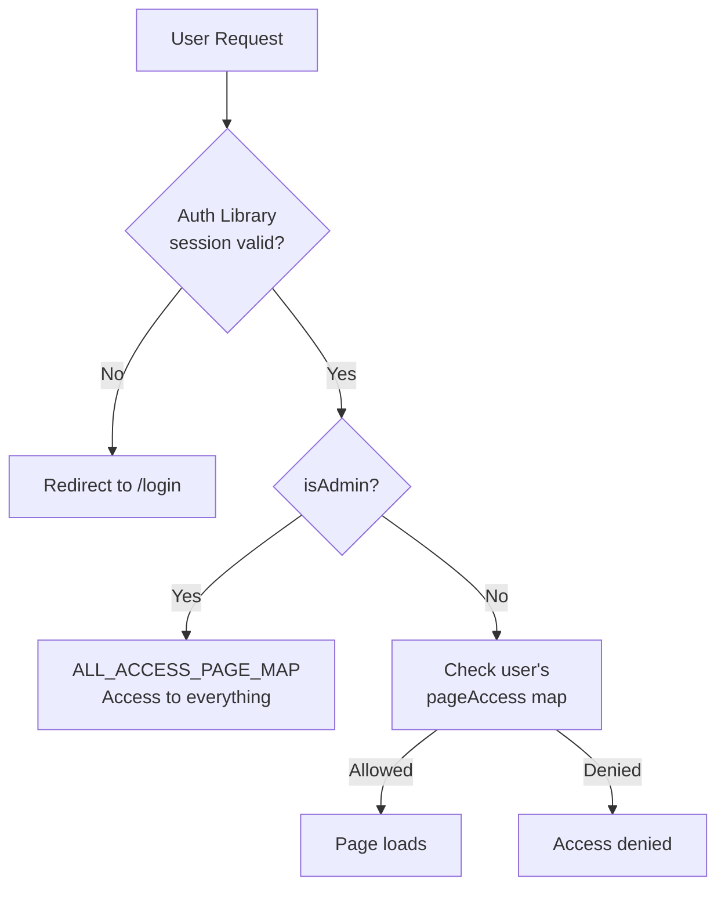
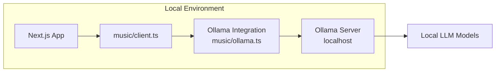
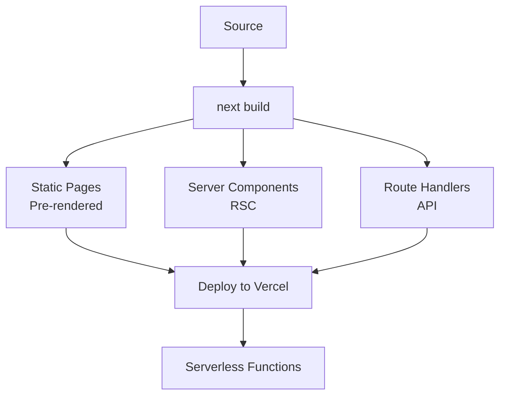

# music_tool-nextJS - Architecture Documentation

## 📋 Project Overview

**music_tool-nextJS** (code: `music-tool`) is a Next.js 16 music production platform that provides a comprehensive suite of music creation tools including Song Studio, DAW (Digital Audio Workstation), Tab Studio, Theory Lab, Progressions, Lyrics Library, and Prompt Library. It includes full authentication, email verification, and per-page access control.

**Version:** 0.1.0  
**Deployment:** Vercel

---

## 🏗️ High-Level Architecture



---

## 🗂️ Directory Structure

```
music_tool-nextJS/
├── src/
│   ├── app/                          # Next.js App Router
│   │   ├── page.tsx                  # Landing / home page
│   │   ├── song-studio/              # Song creation & editing
│   │   │   └── page.tsx
│   │   ├── daw/                      # Digital Audio Workstation
│   │   │   └── page.tsx
│   │   ├── tab-studio/               # Tablature editor
│   │   │   └── page.tsx
│   │   ├── theory-lab/               # Music theory learning
│   │   │   └── page.tsx
│   │   ├── progressions/             # Chord progressions
│   │   │   └── page.tsx
│   │   ├── lyrics-library/           # Lyrics management
│   │   │   └── page.tsx
│   │   ├── prompt-library/           # AI prompt templates
│   │   │   └── page.tsx
│   │   ├── musician-helpers/         # Assistant tools
│   │   │   └── page.tsx
│   │   ├── account/                  # User account
│   │   │   └── page.tsx
│   │   ├── login/                    # Auth pages
│   │   ├── register/
│   │   ├── forgot-password/
│   │   ├── reset-password/
│   │   ├── verify-email/
│   │   └── api/                      # Route Handlers
│   │       ├── music/
│   │       │   ├── songs/
│   │       │   │   ├── route.ts      # CRUD songs
│   │       │   │   ├── [id]/         # Single song
│   │       │   │   │   ├── parts/    # Song parts
│   │       │   │   │   └── partitures/ # Song notation
│   │       │   ├── partitures/[id]/  # Partiture management
│   │       │   └── templates/        # Task templates
│   │       ├── auth/                 # Auth endpoints
│   │       │   ├── register/
│   │       │   ├── login/
│   │       │   ├── logout/
│   │       │   ├── session/
│   │       │   ├── verify-email/
│   │       │   ├── resend-confirmation/
│   │       │   ├── forgot-password/
│   │       │   └── reset-password/
│   │       └── account/
│   │           └── access/           # Access control
│   ├── components/
│   │   ├── music/                    # Music tool clients
│   │   │   ├── song-studio-client.tsx
│   │   │   ├── daw-client.tsx
│   │   │   ├── tab-studio-client.tsx
│   │   │   ├── theory-lab-client.tsx
│   │   │   ├── lyrics-library-client.tsx
│   │   │   ├── progression-client.tsx
│   │   │   ├── templates-client.tsx
│   │   │   ├── helpers-client.tsx
│   │   │   ├── piano-keyboard.tsx
│   │   │   └── audio-provider.tsx
│   │   ├── auth/                      # Auth components
│   │   │   ├── auth-screen.tsx
│   │   │   ├── verify-email-client.tsx
│   │   │   ├── forgot-password-form.tsx
│   │   │   ├── reset-password-form.tsx
│   │   │   └── logout-button.tsx
│   │   ├── account/
│   │   │   └── account-client.tsx
│   │   ├── app-shell.tsx              # App layout shell
│   │   ├── dashboard-card.tsx
│   │   ├── theme-provider.tsx
│   │   ├── theme-toggle.tsx
│   │   └── providers.tsx
│   └── lib/
│       ├── music/
│       │   ├── types.ts               # Typed data models
│       │   ├── db.ts                  # Turso DB operations
│       │   ├── client.ts              # Music API client
│       │   ├── ollama.ts              # Ollama LLM integration
│       │   └── midi-parser.ts         # MIDI parsing utilities
│       ├── auth.ts                    # Auth core (scrypt, JWT, sessions)
│       ├── auth-constants.ts
│       ├── access.ts                  # Per-page access control
│       ├── api.ts                     # API helper
│       └── email.ts                   # Resend email service
├── scripts/
│   └── migrate-legacy-music-ownership.mjs
├── public/
├── next.config.ts
└── package.json
```

---

## 🎵 Music Data Model (Turso)



### Song Structure Detail

Each song consists of:
- **Sections**: Named song sections (verse, chorus, bridge, etc.)
- **Layers**: Instrument/voice layers (vocals, guitar, bass, drums, etc.)
- **Partitures**: Notation/sheet music data
- **MIDI**: Optional arrangement MIDI file with SHA-256 checksum

### Support Tables



Dynamic column additions via `ensureColumn()` using `PRAGMA table_info()` introspection.

---

## 🔐 Authentication & Access Control

### Auth System



- **Password**: scrypt with timing-safe comparison
- **Sessions**: 30-day JWT cookie sessions
- **Email Verification**: 24-hour confirmation tokens
- **Password Reset**: 30-minute secure tokens
- **Admin Bootstrapping**: Specific emails pre-authorized as admins

### Per-Page Access Control

```
MANAGEABLE_PAGES:
  ├── prompt-library
  ├── lyrics-library
  ├── song-studio
  ├── daw
  ├── tab-studio
  ├── musician-helpers
  ├── theory-lab
  └── progressions
```



---

## 🤖 Ollama Integration

The platform integrates with **Ollama** for local AI-powered music generation and enhancement.



---

## 🎹 Feature Modules

### Song Studio
- Full song creation: title, topic, emotion, genre, language
- Reference text, lyrics, structure, hook summary
- Melody JSON, MIDI blueprints, production notes
- Sections & layers management
- AI enhancement via Ollama

### DAW
- Client-side digital audio workstation
- Audio provider for playback

### Tab Studio
- Tablature editor and notation
- Partitures binding to songs

### Theory Lab
- Music theory learning materials
- Piano keyboard interaction

### Progressions
- Chord progression builder

### Lyrics Library
- Lyrics management and search

### Prompt Library
- AI prompt templates with categories
- Task templates for AI agents

---

## 🛠️ Build & Deployment



---

## 📦 Tech Stack Summary

| Category | Technology |
|----------|-----------|
| **Framework** | Next.js 16 (App Router, RSC) |
| **Language** | TypeScript 5 |
| **UI** | HeroUI (Next UI) + TailwindCSS 4 |
| **Database** | Turso (LibSQL) |
| **Auth** | Custom (scrypt + JWT cookies) |
| **AI** | Ollama (local LLM), MIDI parser |
| **Email** | Resend |
| **State** | Framer Motion + Zustand |
| **Icons** | Lucide React |
| **Toasts** | Sonner |
| **Linting** | ESLint |
| **Deploy** | Vercel |