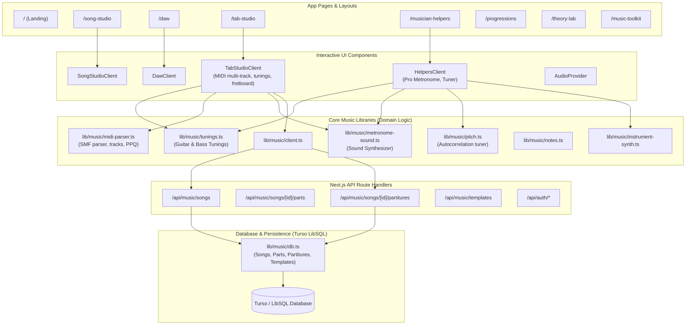

# Project CodeGraph: music_tool-nextJS

> **Version:** 1.0.0 · **Generated:** 2026-09-21T04:22:44.556Z  
> **Total Files:** 103 · **Total Symbols:** 1123 · **API Routes:** 21 · **Graph Edges:** 2892

---

## 🗺️ Architectural Topology & Component Hierarchy



---

## 📡 API Routes Catalog

| HTTP Method | Route URL | Handler File | Description / Domain |
| :--- | :--- | :--- | :--- |
| `GET, POST` | `/api/account/access` | [`src/app/api/account/access/route.ts`](file:///Users/brealypadronrodriguezm4/Downloads/Projects/music_tool-nextJS/src/app/api/account/access/route.ts) | App Router Route Handler |
| `PATCH` | `/api/account/users` | [`src/app/api/account/users/route.ts`](file:///Users/brealypadronrodriguezm4/Downloads/Projects/music_tool-nextJS/src/app/api/account/users/route.ts) | App Router Route Handler |
| `POST` | `/api/auth/forgot-password` | [`src/app/api/auth/forgot-password/route.ts`](file:///Users/brealypadronrodriguezm4/Downloads/Projects/music_tool-nextJS/src/app/api/auth/forgot-password/route.ts) | App Router Route Handler |
| `POST` | `/api/auth/login` | [`src/app/api/auth/login/route.ts`](file:///Users/brealypadronrodriguezm4/Downloads/Projects/music_tool-nextJS/src/app/api/auth/login/route.ts) | App Router Route Handler |
| `POST` | `/api/auth/logout` | [`src/app/api/auth/logout/route.ts`](file:///Users/brealypadronrodriguezm4/Downloads/Projects/music_tool-nextJS/src/app/api/auth/logout/route.ts) | App Router Route Handler |
| `POST` | `/api/auth/register` | [`src/app/api/auth/register/route.ts`](file:///Users/brealypadronrodriguezm4/Downloads/Projects/music_tool-nextJS/src/app/api/auth/register/route.ts) | App Router Route Handler |
| `POST` | `/api/auth/resend-confirmation` | [`src/app/api/auth/resend-confirmation/route.ts`](file:///Users/brealypadronrodriguezm4/Downloads/Projects/music_tool-nextJS/src/app/api/auth/resend-confirmation/route.ts) | App Router Route Handler |
| `POST` | `/api/auth/reset-password` | [`src/app/api/auth/reset-password/route.ts`](file:///Users/brealypadronrodriguezm4/Downloads/Projects/music_tool-nextJS/src/app/api/auth/reset-password/route.ts) | App Router Route Handler |
| `GET` | `/api/auth/session` | [`src/app/api/auth/session/route.ts`](file:///Users/brealypadronrodriguezm4/Downloads/Projects/music_tool-nextJS/src/app/api/auth/session/route.ts) | App Router Route Handler |
| `POST` | `/api/auth/verify-email` | [`src/app/api/auth/verify-email/route.ts`](file:///Users/brealypadronrodriguezm4/Downloads/Projects/music_tool-nextJS/src/app/api/auth/verify-email/route.ts) | App Router Route Handler |
| `GET` | `/api/music/collaborators` | [`src/app/api/music/collaborators/route.ts`](file:///Users/brealypadronrodriguezm4/Downloads/Projects/music_tool-nextJS/src/app/api/music/collaborators/route.ts) | App Router Route Handler |
| `PATCH, DELETE` | `/api/music/partitures/[id]` | [`src/app/api/music/partitures/[id]/route.ts`](file:///Users/brealypadronrodriguezm4/Downloads/Projects/music_tool-nextJS/src/app/api/music/partitures/[id]/route.ts) | App Router Route Handler |
| `GET, PATCH, DELETE` | `/api/music/projects/[id]` | [`src/app/api/music/projects/[id]/route.ts`](file:///Users/brealypadronrodriguezm4/Downloads/Projects/music_tool-nextJS/src/app/api/music/projects/[id]/route.ts) | App Router Route Handler |
| `GET, POST` | `/api/music/projects` | [`src/app/api/music/projects/route.ts`](file:///Users/brealypadronrodriguezm4/Downloads/Projects/music_tool-nextJS/src/app/api/music/projects/route.ts) | App Router Route Handler |
| `POST` | `/api/music/prompts/run` | [`src/app/api/music/prompts/run/route.ts`](file:///Users/brealypadronrodriguezm4/Downloads/Projects/music_tool-nextJS/src/app/api/music/prompts/run/route.ts) | App Router Route Handler |
| `GET, POST` | `/api/music/songs/[id]/partitures` | [`src/app/api/music/songs/[id]/partitures/route.ts`](file:///Users/brealypadronrodriguezm4/Downloads/Projects/music_tool-nextJS/src/app/api/music/songs/[id]/partitures/route.ts) | App Router Route Handler |
| `POST, DELETE` | `/api/music/songs/[id]/parts` | [`src/app/api/music/songs/[id]/parts/route.ts`](file:///Users/brealypadronrodriguezm4/Downloads/Projects/music_tool-nextJS/src/app/api/music/songs/[id]/parts/route.ts) | App Router Route Handler |
| `GET, PATCH, DELETE` | `/api/music/songs/[id]` | [`src/app/api/music/songs/[id]/route.ts`](file:///Users/brealypadronrodriguezm4/Downloads/Projects/music_tool-nextJS/src/app/api/music/songs/[id]/route.ts) | App Router Route Handler |
| `GET, POST` | `/api/music/songs` | [`src/app/api/music/songs/route.ts`](file:///Users/brealypadronrodriguezm4/Downloads/Projects/music_tool-nextJS/src/app/api/music/songs/route.ts) | App Router Route Handler |
| `PATCH, DELETE` | `/api/music/templates/[id]` | [`src/app/api/music/templates/[id]/route.ts`](file:///Users/brealypadronrodriguezm4/Downloads/Projects/music_tool-nextJS/src/app/api/music/templates/[id]/route.ts) | App Router Route Handler |
| `GET, POST` | `/api/music/templates` | [`src/app/api/music/templates/route.ts`](file:///Users/brealypadronrodriguezm4/Downloads/Projects/music_tool-nextJS/src/app/api/music/templates/route.ts) | App Router Route Handler |

---

## 🎸 Key Domain Modules & Libraries

| Module Path | Primary Symbols / Responsibilities | Key Importers |
| :--- | :--- | :--- |
| [`src/lib/music/tunings.ts`](file:///Users/brealypadronrodriguezm4/Downloads/Projects/music_tool-nextJS/src/lib/music/tunings.ts) | `GUITAR_TUNINGS`, `BASS_TUNINGS`, `findClosestString`, `centsFromTarget` | `helpers-client.tsx`, `tab-studio-client.tsx` |
| [`src/lib/music/metronome-sound.ts`](file:///Users/brealypadronrodriguezm4/Downloads/Projects/music_tool-nextJS/src/lib/music/metronome-sound.ts) | `playMetronomeSound`, `MetronomeSoundType` (Digital, Woodblock, Cowbell, Mechanical, Rimshot) | `helpers-client.tsx`, `tab-studio-client.tsx` |
| [`src/lib/music/midi-parser.ts`](file:///Users/brealypadronrodriguezm4/Downloads/Projects/music_tool-nextJS/src/lib/music/midi-parser.ts) | `parseMidiFile`, `parseMidi`, `MidiNote`, `MidiTrackData` | `tab-studio-client.tsx`, `daw-client.tsx` |
| [`src/lib/music/pitch.ts`](file:///Users/brealypadronrodriguezm4/Downloads/Projects/music_tool-nextJS/src/lib/music/pitch.ts) | `detectPitchAutocorrelation`, `PitchDetection` | `helpers-client.tsx` |
| [`src/lib/music/db.ts`](file:///Users/brealypadronrodriguezm4/Downloads/Projects/music_tool-nextJS/src/lib/music/db.ts) | `getSongById`, `createSongRecord`, `fetchPartitures`, Turso CRUD | API Route Handlers |

---

## 🔍 CodeGraph Agent Query CLI Reference

Agents and LLMs can query the CodeGraph directly via command line:

```bash
# Lookup symbol definition and callers
npm run codegraph:query -- symbol playMetronomeSound

# Inspect file dependencies and exported symbols
npm run codegraph:query -- file src/components/music/tab-studio-client.tsx

# List all API routes and methods
npm run codegraph:query -- routes

# Re-generate CodeGraph after code edits
npm run codegraph
```
